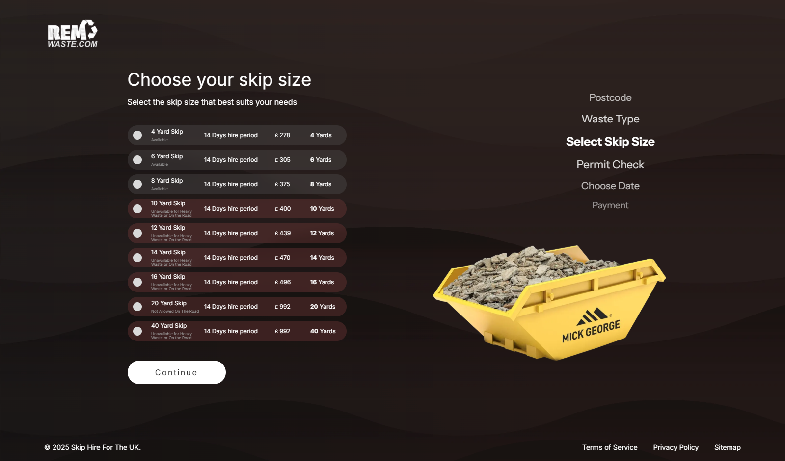

# 🚀 Skip Selector Page Redesign

A modern, responsive, and accessible redesign of a skip selection web page as part of a frontend coding challenge. Built with **Next.js**, **Tailwind CSS**, and **TypeScript** to demonstrate clean architecture, reusable components, and user-centered design.

## 📌 Challenge Brief

As part of a coding challenge, I was asked to visit a specific website page and redesign it with a better UI/UX approach. The goal was to replicate the page's core functionality while improving visual hierarchy, usability, and performance.

## 💡 My Approach

### 🔍 1. Requirements Analysis
- Visited and analyzed the original website page.
- Identified usability issues and areas for improvement.
- Took notes on layout structure, components, interactions, and responsiveness.

### 🧠 2. Design Decisions
- **Minimalistic Layout**: Focused on clear user flow to choose the best skip.
- **Visual Hierarchy**: Used typography, spacing, and contrast to prioritize information.
- **Componentization**: Designed the UI with reusable components in mind.

### ⚙️ 3. Tech Stack
- **Next.js** – For server-side rendering and route-based architecture.
- **Tailwind CSS** – For rapid UI development and consistent design system.
- **TypeScript** – For type safety, better developer experience, and maintainability.

## 📁 Project Structure
    Select Skip
     └── src
          ├── components/ # Reusable UI components (Skip-Size-Card, Steps, etc.)
          ├── app/ # Selector page
          └── assets/ # Images

## 🧩 Key Features

- ✅ Fully responsive layout
- ✅ Accessible components (keyboard-friendly, semantic HTML)
- ✅ Clean, scalable codebase using TypeScript
- ✅ Optimized for performance and maintainability

## 📸 Screenshots

| Original Page | Redesigned Page |
|---------------|-----------------|
|  |  |

## 🧱 Installation

```bash
git clone https://github.com/optistdev/Skip-Selector.git
cd Skip-Selector
npm install
npm run dev